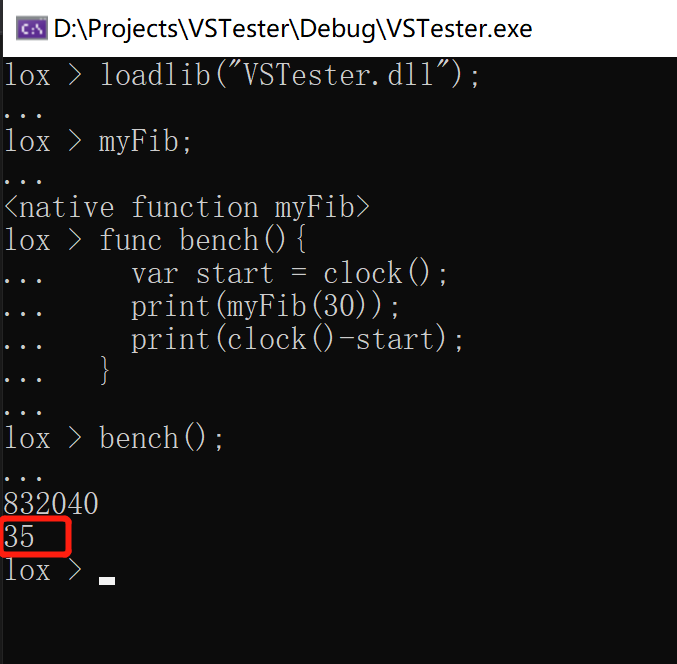

# 动态加载DLL以扩展

## 简介

Dll扩展功能已正式提交至主线，并同时适配Windows和Linux平台。在这里我将记录如何以DLL方式导出cploxplox，以及如何另起项目为cploxplox添加C++扩展。

> Visual Studio搭建好的项目环境，可以见[feature/DLL](https://gitee.com/Morphlng/cploxplox/tree/feature%2FDLL/)分支

## 一、原项目需要做的变动

我们需要将原项目导出成DLL，同时对某些接口做export，以便扩展项目中可以识别符号：

1. Visual Studio中，项目属性-常规-配置类型，设为`动态库DLL`

2. 在需要导出的接口前添加如下宏定义：

    ```c++
    #if defined(_MSC_VER) || defined(WIN64) || defined(_WIN64) || defined(__WIN64__) || defined(WIN32) || defined(_WIN32) || defined(__WIN32__) || defined(__NT__)
    #define Q_DECL_EXPORT __declspec(dllexport)
    #define Q_DECL_IMPORT __declspec(dllimport)
    #else
    #define Q_DECL_EXPORT __attribute__((visibility("default")))
    #define Q_DECL_IMPORT __attribute__((visibility("default")))
    #endif

    #ifdef DLLEXPORT
    #define CXXAPI Q_DECL_EXPORT
    #else
    #define CXXAPI Q_DECL_IMPORT
    #endif
   
    // 则对于整个类导出
    class CXXAPI Object{}
    // 类导出是MSVC独有的特性，为了可能的移植考虑
    // Cxx导出时不使用该特性

    // 或对于方法导出
    class Context{
    public:
        CXXAPI Object& get(const std::string& name);
    }

    // 注：
    // 1. 该导出方式必须在使用项目中包含头文件
    // 2. 友元函数需要特别标明CXXAPI
    // 3. 不能导出类自身的静态变量（Object::Nil），为了解决该问题，我们用如下方法：
    /*
    static CXXAPI Object& Nil()
    {
        static Object nil;
        return nil;
    }
    */
    ```

3. 对于扩展自定义类、自定义函数而言，我们需要导出以下接口：
   - Object全部方法
   - Container中的虚函数
   - Callable全部方法
   - Class全部方法
   - Instance全部方法
   - NativeFunction全部方法
   - NativeMethod全部方法
   - Context中的全部方法
   - Interpreter中的currContext方法（用于获取this）
   - Runner中的runScript和runRepl方法

   具体的接口，可以见[Cxx_Core](Cxx_Core.h)
   
4. 在Visual Studio的，项目属性-C/C++-预处理器中，添加DLLEXPORT的宏定义。

5. 编译项目，将得到一个DLL动态链接库，与一个lib静态符号链接库。将两者拷贝到扩展项目中。

## 二、扩展项目

对于扩展自定义类和函数，将[Cxx_Core.h](./Cxx_Core.h)头文件引入项目即可。你也可以选择将整个cploxplox的include目录引入

1. 在Visual Studio的，项目属性-链接器-输入-附加依赖项中，添加原始项目编译出来的lib文件。这将帮助编译器寻找符号。

2. 类似于CXXAPI，我们需要定义一个EXTAPI：

    ```c++
    #if defined(_MSC_VER) || defined(WIN64) || defined(_WIN64) || defined(__WIN64__) || defined(WIN32) || defined(_WIN32) || defined(__WIN32__) || defined(__NT__)
    #define Q_DECL_EXPORT __declspec(dllexport)
    #define Q_DECL_IMPORT __declspec(dllimport)
    #else
    #define Q_DECL_EXPORT __attribute__((visibility("default")))
    #define Q_DECL_IMPORT __attribute__((visibility("default")))
    #endif

    #ifdef EXT_EXPORT
    #define EXTAPI Q_DECL_EXPORT
    #else
    #define EXTAPI Q_DECL_IMPORT
    #endif
    ```

    同时，你需要在预编译头中添加`EXT_EXPORT`。

3. 设计你需要的扩展，这里以一个函数做示例：

    函数需要继承自NativeFunction，其定义可以如下：

    ```c++
    // .h
    using CXX::NativeFunction
    using CXX::Interpreter
    using CXX::Object
    
    class myFib : public NativeFunction
    {
    public:
        myFib();
    }
    
    // .cpp
    int fib(int n){
        if(n<2) return n;
        return fib(n-1)+fib(n-2);
    }
    
    myFib::myFib() : NativeFunction([](Interpreter& interpreter, const std::vector<Object>& args)
    {
        int result = fib(args[0].getNumber());
        return Object((double)result);
    },
    "myFib", 1)
    {}
    ```

    然后，我们需要以纯C的接口定义导出如下函数：

    ```c++
    // .h
    extern "C" {
        EXTAPI NativeFunction* getFunc_0();
        EXTAPI const char* getFuncName_0();
    }
    
    // .cpp
    NativeFunction* getFunc_0() {
        return new myFib;
    }
    
    const char* getFuncName_0() {
        return "myFib";
    }
    ```

    导出函数和导出类均需要两种方法，对于函数而言就是以上两个（接口不可修改）。

    对于类而言，接口定义如下：

    ```c++
    extern "C"{
        EXTAPI NativeClass* getClass_0();
        EXTAPI const char* getClassName_0();
    }
    ```

4. 编译扩展，获取DLL动态链接库。

5. 新建一个启动项目，该项目仅需要引用`Runner.h`，同样链接原项目生成的lib符号之后，最简单的启动项可以为：

   ```c++
   #include "Runner.h"
   
   int main(){
       return CXX::Runner::runRepl();
   }
   ```

   你需要将原项目的DLL放置在exe程序同目录下，方可运行。

6. 调用扩展方法：

   ```lua
   lox > loadlib("myFib.dll");
   lox > myFib;
   <native Function myFib>
   lox > print(myFib(30));
   832040
       
   <-- 用时仅35ms，同样的cploxplox函数需要900ms -->
   ```

<div align='center'>
    
</div>

## 三、注意

1. 一个dll中可以导出多个函数和类，只需要在导出接口命名时遵循：`getFunc_{序号}`、`getFuncName_{序号}`这样的规则即可
2. [Dict](Dict.h)展示了扩展类的例子，该示例同时演示了如何存储非Cxx原生类型