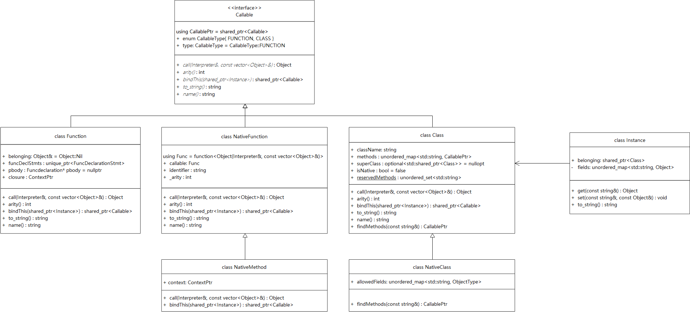

# 如何扩展Cploxplox

本篇将讲述Cploxplox中内置函数与内置类的抽象方式，以及你该如何添加自己的内置方法。

## 一、Cploxplox中的Callable

函数和类都可以使用`()`的方式*调用*，因此它们都属于Callable的类。如果用Java中的设计理念，就是说函数和类都应该实现Callable这个接口。下面的UML图中，展示了Cploxplox中所有Callable类的关系：



对于扩展Cploxplox的内置功能而言，我们只需要关注`NativeFunction`与`NativeClass`即可。(`NativeMethod`是NativeClass的methods中应当存储的函数)

## 二、NativeFunction

NativeFunction与普通的Function唯一的区别在于，内置函数存储的不是用户输入的函数定义节点(FuncDeclarationStmt)，而是一个真正的函数。

这里我们使用`std::function<Object(Interpreter &, const std::vector<Object> &)>`来存储一个函数，并且这个定义方式满足Callable的call函数定义，因此我们不需要修改Interpreter，按照正常的CallExpr解释即可。

在命名空间standardFunctions中，我展示了几个内置方法的定义：

```c++
class Clock : public NativeFunction
{
public:
     Clock() : NativeFunction([](Interpreter &interpreter, const std::vector<Object> &args)
                                    {
                                        using namespace std::chrono;
                                        double ms = static_cast<double>(duration_cast<milliseconds>(system_clock::now().time_since_epoch()).count());
                                        return Object(ms);
                                    },
                                    "clock", 0)
    {}
};
```

1. 你可以选择为每个内置方法定义一个**继承自NativeFunction的类**，通过在构造函数中定义Lambda函数的形式完成功能定义。这之后，在Interpreter的`loadPresetEnvironment()`函数中，为全局变量globalContext添加该类：

```c++
void Interpreter::loadPresetEnvironment()
{
    CallablePtr clock = std::make_shared<standardFunctions::Clock>();
    Object func(std::move(clock));
    globalContext->set(func.getCallable()->name(), func);
}
```

2. 你也可以直接在loadPresetEnvironment中添加一个NativeFunction的实例

## 三、NativeClass

NativeClass的定义方式要更加简单，但是有几个需要注意的点。下面我们先看示例：

```c++
class String : public NativeClass
{
public:
    String();

private:
    static std::string value;
};

std::string String::value = "str";

String::String() : NativeClass("String")
{
    // 1. 定义内部类允许的成员，及成员类型
    allowedFields.insert({"str", ObjectType::STRING});

    // 2. 添加构造函数
    methods.insert(
        {"init", std::make_shared<NativeMethod>([&](Interpreter &interpreter, const std::vector<Object> &args)
                                                {
                                                    Object &instance = interpreter.context->getAt("this", 0);
                                                    instance.getInstance()->set(value, Object(args[0].to_string()));

                                                    return Object::Nil;
                                                },
                                                1)});

    // 3. 添加自定义方法
    methods.insert(
        {"length", std::make_shared<NativeMethod>([&](Interpreter &interpreter, const std::vector<Object> &args)
                                                  {
                                                      Object &instance = interpreter.context->getAt("this", 0);
                                                      // 因为初始化时已经转为字符串，所以这里一定拿到一个string
                                                      Object str = instance.getInstance()->get(value);

                                                      return Object((double)str.getString().value().length());
                                                  },
                                                  0)});

    // 4. (可选)定义算符重载
    methods.insert(
        {"__equal__",
         std::make_shared<NativeMethod>([&](Interpreter &interpreter, const std::vector<Object> &args)
                                        {
                                            Object &instance = interpreter.context->getAt("this", 0);
                                            // 因为初始化时已经转为字符串，所以这里一定拿到一个string
                                            Object lhs = instance.getInstance()->get(value);
                                            // should be all string
                                            Object rhs = args[0].getInstance()->get(value);

                                            // equal返回的Object必须是ObjectType::BOOLEAN
                                            return Object(lhs == rhs);
                                        },
                                        1)});
}
```

### 3.1 allowedFields

内部类不像用户自定义的类，一般而言它的成员函数都是针对编写时固定的属性字段提供的方法，因此对于一个内部类实例，允许用户随意向其中添加字段是没有意义的。

allowedField是定义在`NativeClass`中的一个哈希表，在定义一个新的内部类时，你应该明确它可以拥有的属性字段，以及该字段的类型。

> 在最后的实现中，用户向内部类中添加未定义字段只是无效果，不会报错

### 3.2 构造函数

根据你的需要，提供相应的构造函数，目前还不支持省略参数以及函数重载。

### 3.3 自定义方法

这一部分是你自由发挥的地方，欢迎为你的自定类添加任何奇技淫巧的方法！

我们看一下上面例子中，添加方法的示例：

```c++
// 3. 添加方法
methods.insert(
        {"length", std::make_shared<NativeMethod>([&](Interpreter &interpreter, const std::vector<Object> &args)
                                                  {
                                                      Object &instance = interpreter.context->getAt("this", 0);
                                                      // 因为初始化时已经转为字符串，所以这里一定拿到一个string
                                                      Object str = instance.getInstance()->get(value);

                                                      return Object((double)str.getString().value().length());
                                                  },
                                                  0)});
```

1. 你需要向method中添加一对键值，格式为：`string : shared_ptr<NativeMethod>`
2. NativeMethod构造时接受2(3)个参数，分别为：`函数体`(Lambda)、`接收参数个数`(arity)、`运行环境`(Context)。在定义时，你不需要第三个参数，这是在调用时bindThis才会用到的。
3. 在函数体中，使用`interpreter.context->getAt("this", 0);`，获取到类实例自己
4. 根据你的需求，自由发挥吧！

### 3.4 保留方法

在`Class`中定义了一个静态哈希表`static std::unordered_set<std::string> reservedMethods;`，这里存储了一些预留函数，例如：`__add__`、`__equal__`。它们相当于运算符重载，当你的类中有这些函数的定义时，相应的运算会对其进行调用。

这有助于解决类型转换的问题，例如在上例中我们的内部类String和默认的裸字符串string，本身是不支持拼接(`+`)操作的，我们可以通过重载`__add__`函数来对其进行处理。